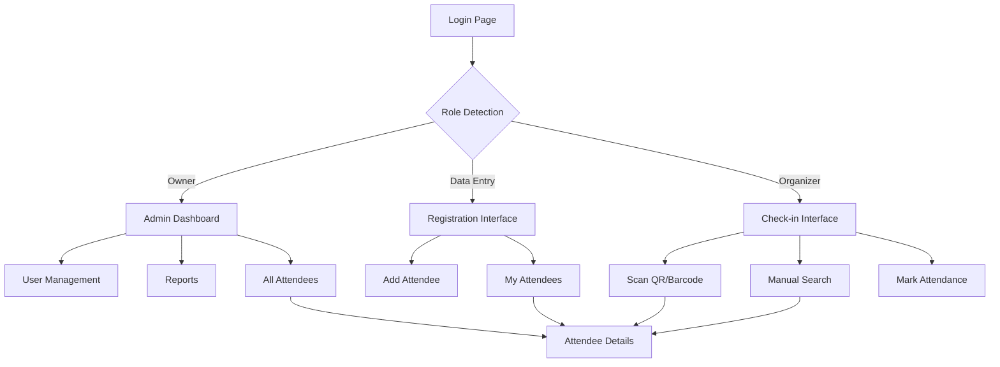

## 1. Product Overview

A comprehensive event management system designed to handle attendee registration, payment tracking, and attendance management for large-scale events. The system enables efficient management of thousands of attendees with role-based access control and real-time attendance tracking.

The system solves the problem of manual event management by providing automated registration, payment tracking, QR/barcode generation, and fast check-in processes. It's designed for event organizers who need to manage large crowds efficiently while maintaining data security and role-based access control.

## 2. Core Features

### 2.1 User Roles

| Role | Registration Method | Core Permissions |
|------|-------------------|------------------|
| Owner (Admin) | Manual creation by system | Full system access, user management, analytics, dynamic field configuration |
| Data Entry | Admin invitation | Add/edit attendees (only their own records), view their created attendees |
| Organizer | Admin invitation | View all attendees, search attendees, mark attendance via scan/manual, no data editing |

### 2.2 Feature Module

Our event management system consists of the following main pages:

1. **Login Page**: User authentication, role-based redirect
2. **Dashboard**: Analytics overview, quick stats, recent activity
3. **Attendee Registration**: Dynamic form with validation, payment tracking, seat selection
4. **Attendee Management**: Search, filter, view attendee details, payment status
5. **Check-in Interface**: QR/Barcode scanner, manual attendance marking, real-time updates
6. **User Management**: Add/remove users, role assignment (Admin only)
7. **Reports**: Financial reports, attendance statistics (Admin only)

### 2.3 Page Details

| Page Name | Module Name | Feature description |
|-----------|-------------|---------------------|
| Login Page | Authentication | Email/password login, role detection, session management |
| Dashboard | Statistics Overview | Display total attendees, revenue, attendance rate, seat class distribution |
| Dashboard | Quick Actions | Quick registration button, recent check-ins, pending payments |
| Registration | Attendee Form | Triple name (required), phone numbers (dynamic add second), emails (dynamic add second), Facebook link (optional), governorate dropdown (Minya, Asyut, Sohag, Qena) |
| Registration | Seat Selection | Class A (2000 EGP), Class B (1700 EGP), Class C (1500 EGP) with real-time availability |
| Registration | Payment Tracking | Status selection (Interested/Registered), payment type (Deposit 200 EGP/Full Payment), remaining amount calculation |
| Registration | Identity Generation | Generate unique QR code and barcode upon registration completion |
| Attendee Management | Search & Filter | Search by name/phone/email, filter by governorate, seat class, payment status, attendance status |
| Attendee Management | Attendee Details | View complete profile, payment history, seat assignment, attendance record |
| Check-in Interface | Scanner | Camera-based QR scanning, hardware barcode scanner support, instant attendance marking |
| Check-in Interface | Manual Entry | Search attendee by name/phone, manual attendance toggle, bulk operations |
| User Management | User List | View all system users, their roles, creation date, last activity |
| User Management | User Operations | Add new user, assign role, deactivate/activate user, reset password |
| Reports | Financial Reports | Revenue by seat class, payment status breakdown, deposit vs full payment statistics |
| Reports | Attendance Reports | Total attendance, attendance by governorate, seat class attendance rate |

## 3. Core Process

### Owner (Admin) Flow
The admin starts by logging into the system and accessing the comprehensive dashboard showing overall event statistics. From there, they can navigate to user management to create data entry and organizer accounts. The admin can view all attendees, manage payments, generate reports, and configure system settings. They have unrestricted access to all features including attendee registration, payment modifications, and system analytics.

### Data Entry Flow
Data entry users log in and are immediately directed to the attendee registration interface. They can add new attendees with all required information including personal details, seat selection, and payment tracking. They can view and edit only the attendees they have personally registered, allowing them to correct mistakes or update information. They cannot access attendees registered by other users or view system analytics.

### Organizer Flow
Organizers access the system primarily for attendance management. After login, they can view all attendees in a searchable list. Their main function is to mark attendance using either the QR/barcode scanner or manual search and toggle. They can see attendee basic information but cannot modify any data. Their interface is optimized for speed to handle large crowds efficiently.

## 4. User Interface Design

### 4.1 Design Style
- **Primary Colors**: Deep blue (#1e40af) for primary actions, emerald (#10b981) for success states
- **Secondary Colors**: Gray scale for neutral elements, red (#ef4444) for warnings/deletions
- **Button Style**: Rounded corners (8px radius), subtle shadows, hover effects
- **Typography**: Inter font family, 16px base size, clear hierarchy with h1-h6
- **Layout**: Card-based design with consistent spacing (8px grid system)
- **Icons**: Heroicons for consistency, emoji sparingly for user-friendly elements

### 4.2 Page Design Overview

| Page Name | Module Name | UI Elements |
|-----------|-------------|-------------|
| Login Page | Authentication | Centered card layout, gradient background, large input fields with icons, prominent login button |
| Dashboard | Statistics | Grid layout of metric cards, progress bars for attendance rates, chart.js graphs for trends |
| Registration | Form | Multi-step form with progress indicator, dynamic field addition buttons, real-time validation feedback |
| Attendee Management | Search | Top search bar with filters sidebar, data table with sorting, pagination for large datasets |
| Check-in Interface | Scanner | Full-screen scanner mode, large attendance status display, quick access to manual search |
| User Management | User List | Clean table layout, role badges with colors, action buttons grouped logically |

### 4.3 Responsiveness
Desktop-first design approach with full mobile adaptation. The system is optimized for tablet and desktop use during registration and check-in processes, while maintaining full functionality on mobile devices. Touch interactions are enhanced for scanner interfaces and form inputs.

### 4.4 Performance Requirements
- Registration form submission: < 2 seconds
- QR/Barcode scan processing: < 1 second
- Attendee search results: < 500ms
- Dashboard loading: < 3 seconds
- Concurrent user support: 1000+ simultaneous operations