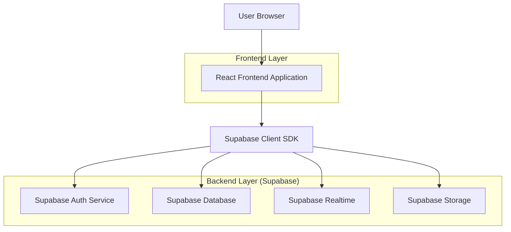
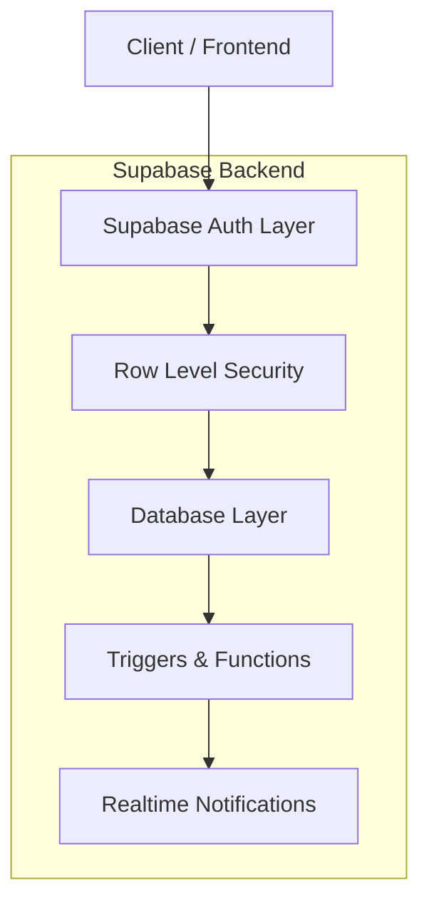
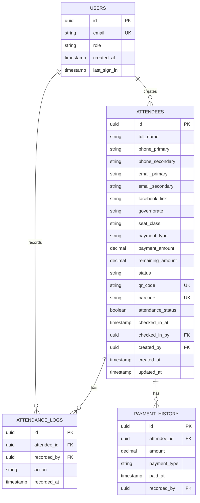

## 1. Architecture Design



## 2. Technology Description

- Frontend: React@18 + TypeScript + Tailwind CSS@3 + Vite
- Initialization Tool: vite-init
- Backend: Supabase (Auth, Database, Realtime, Storage)
- UI Components: shadcn/ui + Radix UI
- QR/Barcode: qrcode.react + jsbarcode
- State Management: React Context + useReducer
- Form Handling: React Hook Form + Zod validation

## 3. Route Definitions

| Route | Purpose |
|-------|---------|
| /login | User authentication with role-based redirect |
| /dashboard | Main dashboard with statistics and quick actions |
| /register | Attendee registration form with dynamic fields |
| /attendees | List and search all attendees with filters |
| /attendees/:id | Detailed attendee view and edit |
| /checkin | QR/Barcode scanner interface for attendance |
| /users | User management (Admin only) |
| /reports | Analytics and reports (Admin only) |
| /profile | User profile and settings |

## 4. API Definitions

### 4.1 Authentication APIs

```
POST /auth/v1/token
```

Request:
| Param Name | Param Type | isRequired | Description |
|------------|------------|------------|-------------|
| email | string | true | User email address |
| password | string | true | User password |

Response: Supabase session object with access token and user data

### 4.2 Attendee APIs

```
GET /rest/v1/attendees
```

Query Parameters:
| Param Name | Param Type | Description |
|------------|------------|-------------|
| select | string | Fields to select |
| governorate | string | Filter by governorate |
| seat_class | string | Filter by seat class |
| payment_status | string | Filter by payment status |
| attendance_status | string | Filter by attendance status |
| created_by | uuid | Filter by creator (for data entry users) |

```
POST /rest/v1/attendees
```

Request Body:
```json
{
  "full_name": "string",
  "phone_primary": "string",
  "phone_secondary": "string",
  "email_primary": "string",
  "email_secondary": "string",
  "facebook_link": "string",
  "governorate": "Minya|Asyut|Sohag|Qena",
  "seat_class": "A|B|C",
  "payment_type": "deposit|full",
  "payment_amount": "number",
  "status": "interested|registered",
  "qr_code": "string",
  "barcode": "string"
}
```

### 4.3 Attendance APIs

```
PATCH /rest/v1/attendees?id=eq.{id}
```

Request Body:
```json
{
  "attendance_status": "present",
  "checked_in_at": "timestamp",
  "checked_in_by": "uuid"
}
```

## 5. Server Architecture Diagram



## 6. Data Model

### 6.1 Data Model Definition



### 6.2 Data Definition Language

Users Table (users)
```sql
-- Create users table (managed by Supabase Auth)
CREATE TABLE users (
    id UUID PRIMARY KEY DEFAULT auth.uid(),
    email VARCHAR(255) UNIQUE NOT NULL,
    role VARCHAR(20) NOT NULL DEFAULT 'data_entry' CHECK (role IN ('owner', 'organizer', 'data_entry')),
    created_at TIMESTAMP WITH TIME ZONE DEFAULT NOW(),
    updated_at TIMESTAMP WITH TIME ZONE DEFAULT NOW()
);

-- Enable RLS
ALTER TABLE users ENABLE ROW LEVEL SECURITY;

-- Policies
CREATE POLICY "Users can view own profile" ON users FOR SELECT USING (auth.uid() = id);
CREATE POLICY "Owner can view all users" ON users FOR SELECT USING (EXISTS (
    SELECT 1 FROM users WHERE id = auth.uid() AND role = 'owner'
));
CREATE POLICY "Owner can manage users" ON users FOR ALL USING (EXISTS (
    SELECT 1 FROM users WHERE id = auth.uid() AND role = 'owner'
));
```

Attendees Table (attendees)
```sql
-- Create attendees table
CREATE TABLE attendees (
    id UUID PRIMARY KEY DEFAULT gen_random_uuid(),
    full_name VARCHAR(255) NOT NULL,
    phone_primary VARCHAR(20),
    phone_secondary VARCHAR(20),
    email_primary VARCHAR(255),
    email_secondary VARCHAR(255),
    facebook_link VARCHAR(500),
    governorate VARCHAR(20) CHECK (governorate IN ('Minya', 'Asyut', 'Sohag', 'Qena')),
    seat_class VARCHAR(1) CHECK (seat_class IN ('A', 'B', 'C')),
    payment_type VARCHAR(10) CHECK (payment_type IN ('deposit', 'full')),
    payment_amount DECIMAL(10,2) DEFAULT 0,
    remaining_amount DECIMAL(10,2) DEFAULT 0,
    status VARCHAR(20) CHECK (status IN ('interested', 'registered')),
    qr_code VARCHAR(255) UNIQUE,
    barcode VARCHAR(255) UNIQUE,
    attendance_status BOOLEAN DEFAULT FALSE,
    checked_in_at TIMESTAMP WITH TIME ZONE,
    checked_in_by UUID REFERENCES users(id),
    created_by UUID REFERENCES users(id),
    created_at TIMESTAMP WITH TIME ZONE DEFAULT NOW(),
    updated_at TIMESTAMP WITH TIME ZONE DEFAULT NOW()
);

-- Create indexes
CREATE INDEX idx_attendees_governorate ON attendees(governorate);
CREATE INDEX idx_attendees_seat_class ON attendees(seat_class);
CREATE INDEX idx_attendees_payment_status ON attendees(payment_type);
CREATE INDEX idx_attendees_attendance_status ON attendees(attendance_status);
CREATE INDEX idx_attendees_created_by ON attendees(created_by);
CREATE INDEX idx_attendees_qr_code ON attendees(qr_code);
CREATE INDEX idx_attendees_barcode ON attendees(barcode);

-- Enable RLS
ALTER TABLE attendees ENABLE ROW LEVEL SECURITY;

-- Policies
CREATE POLICY "Data entry can view own attendees" ON attendees FOR SELECT USING (
    created_by = auth.uid() OR EXISTS (
        SELECT 1 FROM users WHERE id = auth.uid() AND role IN ('owner', 'organizer')
    )
);

CREATE POLICY "Data entry can insert attendees" ON attendees FOR INSERT WITH CHECK (
    created_by = auth.uid() AND EXISTS (
        SELECT 1 FROM users WHERE id = auth.uid() AND role IN ('owner', 'data_entry')
    )
);

CREATE POLICY "Data entry can update own attendees" ON attendees FOR UPDATE USING (
    created_by = auth.uid() AND EXISTS (
        SELECT 1 FROM users WHERE id = auth.uid() AND role IN ('owner', 'data_entry')
    )
);

CREATE POLICY "Organizer can view all attendees" ON attendees FOR SELECT USING (
    EXISTS (
        SELECT 1 FROM users WHERE id = auth.uid() AND role = 'organizer'
    )
);

CREATE POLICY "Organizer can update attendance" ON attendees FOR UPDATE USING (
    EXISTS (
        SELECT 1 FROM users WHERE id = auth.uid() AND role = 'organizer'
    )
);

CREATE POLICY "Owner has full access" ON attendees FOR ALL USING (
    EXISTS (
        SELECT 1 FROM users WHERE id = auth.uid() AND role = 'owner'
    )
);
```

Attendance Logs Table (attendance_logs)
```sql
-- Create attendance logs table
CREATE TABLE attendance_logs (
    id UUID PRIMARY KEY DEFAULT gen_random_uuid(),
    attendee_id UUID REFERENCES attendees(id) ON DELETE CASCADE,
    recorded_by UUID REFERENCES users(id),
    action VARCHAR(50) NOT NULL,
    recorded_at TIMESTAMP WITH TIME ZONE DEFAULT NOW()
);

-- Create index
CREATE INDEX idx_attendance_logs_attendee_id ON attendance_logs(attendee_id);
CREATE INDEX idx_attendance_logs_recorded_at ON attendance_logs(recorded_at DESC);

-- Enable RLS
ALTER TABLE attendance_logs ENABLE ROW LEVEL SECURITY;

-- Policies
CREATE POLICY "All authenticated users can view logs" ON attendance_logs FOR SELECT USING (auth.uid() IS NOT NULL);
CREATE POLICY "Authenticated users can insert logs" ON attendance_logs FOR INSERT WITH CHECK (auth.uid() IS NOT NULL);
```

Payment History Table (payment_history)
```sql
-- Create payment history table
CREATE TABLE payment_history (
    id UUID PRIMARY KEY DEFAULT gen_random_uuid(),
    attendee_id UUID REFERENCES attendees(id) ON DELETE CASCADE,
    amount DECIMAL(10,2) NOT NULL,
    payment_type VARCHAR(20) NOT NULL,
    paid_at TIMESTAMP WITH TIME ZONE DEFAULT NOW(),
    recorded_by UUID REFERENCES users(id)
);

-- Create index
CREATE INDEX idx_payment_history_attendee_id ON payment_history(attendee_id);
CREATE INDEX idx_payment_history_paid_at ON payment_history(paid_at DESC);

-- Enable RLS
ALTER TABLE payment_history ENABLE ROW LEVEL SECURITY;

-- Policies
CREATE POLICY "Owner and data entry can view payment history" ON payment_history FOR SELECT USING (
    EXISTS (
        SELECT 1 FROM users WHERE id = auth.uid() AND role IN ('owner', 'data_entry')
    )
);

CREATE POLICY "Owner and data entry can insert payment history" ON payment_history FOR INSERT WITH CHECK (
    EXISTS (
        SELECT 1 FROM users WHERE id = auth.uid() AND role IN ('owner', 'data_entry')
    )
);
```

### 6.3 Functions and Triggers

```sql
-- Function to generate QR code and barcode
CREATE OR REPLACE FUNCTION generate_attendee_codes()
RETURNS TRIGGER AS $$
BEGIN
    NEW.qr_code := 'QR_' || NEW.id::text || '_' || floor(random() * 10000)::text;
    NEW.barcode := 'BC_' || floor(random() * 1000000000)::text;
    RETURN NEW;
END;
$$ LANGUAGE plpgsql;

-- Trigger to generate codes before insert
CREATE TRIGGER trigger_generate_codes
    BEFORE INSERT ON attendees
    FOR EACH ROW
    EXECUTE FUNCTION generate_attendee_codes();

-- Function to calculate remaining amount
CREATE OR REPLACE FUNCTION calculate_remaining_amount()
RETURNS TRIGGER AS $$
BEGIN
    IF NEW.payment_type = 'deposit' THEN
        NEW.remaining_amount := CASE 
            WHEN NEW.seat_class = 'A' THEN 2000 - NEW.payment_amount
            WHEN NEW.seat_class = 'B' THEN 1700 - NEW.payment_amount
            WHEN NEW.seat_class = 'C' THEN 1500 - NEW.payment_amount
            ELSE 0
        END;
    ELSIF NEW.payment_type = 'full' THEN
        NEW.remaining_amount := 0;
    END IF;
    RETURN NEW;
END;
$$ LANGUAGE plpgsql;

-- Trigger to calculate remaining amount
CREATE TRIGGER trigger_calculate_remaining
    BEFORE INSERT OR UPDATE ON attendees
    FOR EACH ROW
    EXECUTE FUNCTION calculate_remaining_amount();
```

### 6.4 Row Level Security Grants

```sql
-- Grant basic permissions
GRANT SELECT ON users TO anon;
GRANT SELECT ON attendees TO anon;
GRANT SELECT ON attendance_logs TO anon;
GRANT SELECT ON payment_history TO anon;

-- Grant authenticated user permissions
GRANT ALL PRIVILEGES ON users TO authenticated;
GRANT ALL PRIVILEGES ON attendees TO authenticated;
GRANT ALL PRIVILEGES ON attendance_logs TO authenticated;
GRANT ALL PRIVILEGES ON payment_history TO authenticated;
```